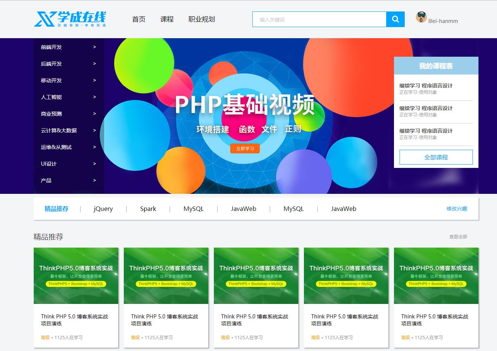
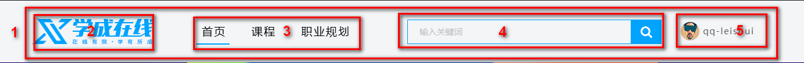
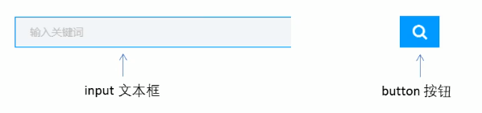
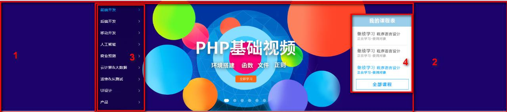
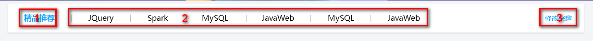
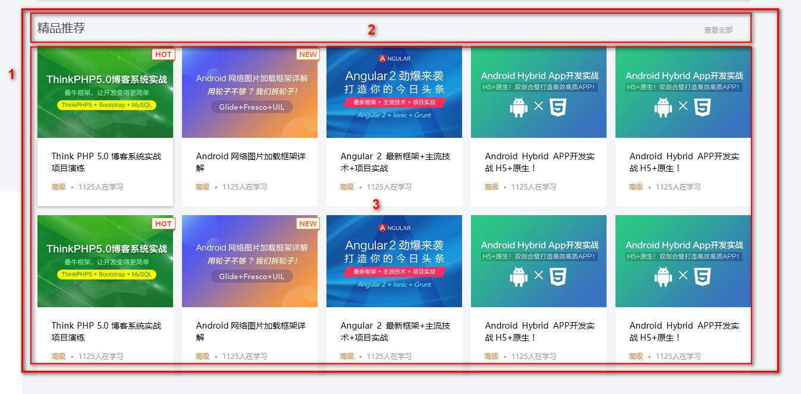
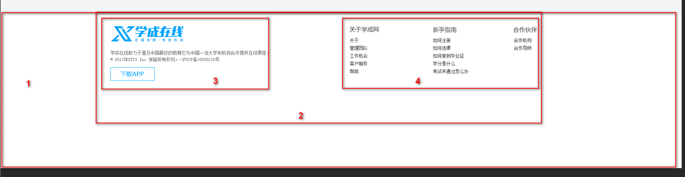

# 1 常见的图片格式

* jpg图像格式：jgp（jpeg）对色彩的信息保留较好，高清，颜色较多，产品类的图片经常使用jpg格式。
* gif图像格式：gif格式最多只能存储256色，所以通常用来显示简单图形及字体，但是可以保存透明背景和动态效果，实际经常用于一些图片小动画效果。
* png图像格式：是一种新兴的网络图形格式，结合了gif和jpg的优点，具有存储形式丰富的特点，能够保持透明背景。如果想要切成背景透明的图片，请选择png格式。
* psd图像格式：是Photoshop的专用格式，里面可以存放图层、通道、遮罩等多种设计稿。对前端来说，最大的优点，可以从上面复制文件、获取图片、测量大小和距离。

# 2 学成在线案例的目的



* 典型的企业级网站。
* 目的是为了整体感知企业级网站布局流程，复习前面学习的知识。

# 3 准备工作

* 学成在线psd源文件。
* 开发工具 = PS（切图）/ cutterman插件 + vscode （代码） + chrome（测试）。

# 4 案例准备工作

* 本次采取结构和样式相分离的思想：
* ①创建study目录文件夹，用于存放页面相关的内容。
* ②study目录内新建images文件夹，用于保存图片。
* ③新建首页index.html（网站的首页统一规定为index.html）。
* ④新建style.css样式文件。本次采用外链样式表。
* ⑤将样式引入到index.html页面中。
* ⑥样式表中写入清除内外边距的样式，来检测样式表是否引入成功。

# 5 CSS属性书写顺序

* 建议遵循以下顺序：
* ①布局定位属性：display / position / float / clear / visibility / overflow（建议 display 第一个写，毕竟关系到模式）
* ②自身属性：width / height / margin / padding / border / background
* ③文本属性：color / font / text-decoration / text-align / vertical-align / white- space / break-word
* ④其他属性（CSS3）：content / cursor / border-radius / box-shadow / text-shadow / background:linear-gradient …


* 示例：

```css
.jdc {
    display: block; 
    position: relative; 
    float: left; 
    width: 100px; 
    height: 100px; 
    margin: 0 10px; 
    padding: 20px 0;
    font-family: Arial, 'Helvetica Neue', Helvetica, sans-serif; 
    color: #333;
	background: rgba(0,0,0,.5); border-radius: 10px;
}
```

# 6 页面布局整体思路

* 为了提高网页制作的效率，布局的时候通常有以下的整体思路：
* ①必须确定页面的版心（可视区），我们测量可知。
* ②分析页面中的行模块，以及每个行模块中的列模块。页面布局第一准则。
* ③一行中的列模块经常浮动布局，先确定每个列的大小，之后确定列的位置。页面布局第二准则。
* ④制作HTML结构。我们需要遵循先有结构，后有样式的原则。结构永远最重要。
* ⑤开始运用盒子模型的原理，通过div+css布局来控制网页的各个模块。

# 7 确定版心

* 这个页面的版心是1200px，每个版心都要水平居中对齐，可以定义版心为公共类：

```css
/* 版心 */
.w {
  width: 1200px;
  margin: 0 auto;
}
```

# 8 头部制作



* 1号是版心盒子header 1200 * 42 的盒子水平居中对齐，上下给一个margin值就可以了。
* 版心盒子header里面包含2号盒子logo。
* 版心盒子header里面包含3号盒子nav导航栏。
* 版心盒子header里面包含4号盒子search搜索框。
* 版心盒子header里面包含5号盒子user个人信息。

> 注意：要求里面的4个盒子必须都是浮动。

* 导航栏注意事项：
    * 实际开发中，我们不会直接用超链接a，而是用li包含超链接a的做法（li+a）。
    * ①li+a语义更清晰，一看就是有条理的列表型内容。
    * ②如果直接使用a，搜索引擎容易辨别为有堆砌关键字嫌疑（故意堆砌关键字容器被搜索引擎降权），从而影响网站排名（当然对于竞价排名来说，就是另外一回事了）。

> 注意：
>
> * 让导航栏一行显示，给li加浮动，因为li是块级元素，需要一行显示。
> * nav导航栏可以不给宽度，将来可以继续添加其余文字。
> * 导航栏里面的文字不一样多，最好给超链接a左右padding撑开盒子，而不是指定宽度。

* search搜索框：一个search大盒子里面包含2个表单。

  

# 9 banner制作



* 1号盒子是通栏的大盒子banner，不给宽度，给高度，给一个蓝色背景。
* 2号盒子是版心，要水平居中显示。
* 3号盒子版心内，左对齐subnav测导航栏。
* 4号盒子版心内，右对齐course课程。

# 10 精品推荐小模块



* 大盒子水平居中goods精品，注意此处有个盒子阴影。
* 1号盒子是标题H3左侧浮动。
* 2号盒子里面放超链接左侧浮动，goods-item距离可以控制链接的左右外边距（注意行内元素只给左右内外边距）。
* 3号盒子右浮动mod修改。

# 11 精品推荐大模块



* 1号盒子为最大的盒子，box版心水平居中对齐。
* 2号盒子为上面部分，box-hd左侧里面h3左浮动，左侧超链接a右浮动。
* 3号盒子为下面部分，box-bd里面是无序列表，有10个小li组成。
* 小li外边距的问题，这里有个小技巧：给box-hd宽度为1225px就可以一行展开5个li。

# 12 底部模块



* 1号盒子是通栏大盒子，底部footer给高度，底色是白色。
* 2号盒子版心水平居中。
* 3号盒子版权copyright左对齐。
* 4号盒子链接组links右对齐。

