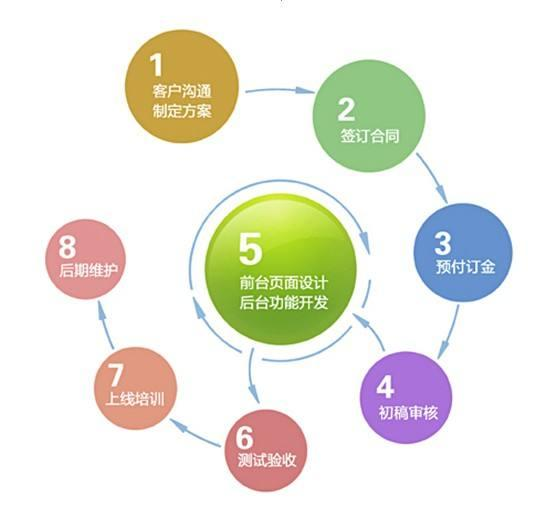

# 1 目标

* 能够独立完成品优购首页制作。
* 能够独立完成品优购列表页制作。
* 能够独立完成品优购注册页制作。
* 能够把品优购网站部署上线。


# 2 品优购项目规划

## 2.1 网站制作流程



## 2.2 品优购项目整体介绍

* 项目名称：品优购。
* 项目描述：品优购是一个电商网站，我们要完成PC端首页、列表页、注册页面的制作。


## 2.3 品优购项目学习目的

* 电商类网站比较综合，里面需要大量的布局技术，包括布局方式、常见效果以及周边技术。
* 品优购项目能复习、总结、提高所学的布局技术。
* 写完品优购项目，能对实际开发中`制作PC端页面流程`由一个整体的感知。
* 为后期学习移动端项目做铺垫。

## 2.4 开发工具以及技术栈

### 2.4.1 开发工具

* VSCode。
* Photoshop。
* Chrome浏览器。

### 2.4.2 技术栈

* 利用HTML5+CSS3手动布局，可以大量使用H5新增标签和样式。
* 采取结构和样式相分离，模块化开发。
* 良好的代码规范有利于团队更好的开发协作，提高代码质量，因此品优购项目中，需要遵循以下代码规范（详见`品优购代码规范.md`）。

## 2.5 品优购项目搭建工作

### 2.5.1 需要创建如下文件夹

| 名称             | 描述     |
| ---------------- | -------- |
| 项目文件夹       | shopping |
| 样式类图片文件夹 | images   |
| 样式文件夹       | css      |
| 产品类图片文件夹 | upload   |
| 字体类文件夹     | fonts    |
| 脚本文件夹       | js       |

### 2.5.2 需要创建如下文件

| 名称              | 说明       |
| ----------------- | ---------- |
| 首页              | index.html |
| css初始化样式文件 | base.css   |
| css公共样式文件   | common.css |

### 2.5.3 模块化开发

* 所谓的模块化：将一个项目按照功能划分，一个功能一个模块，互不影响。
* 模块化开发具有重复使用、更换方便等优点。
* 代码也是如此，有些样式和结构在很多页面都会出现，比如页面头部和底部，大部分页面都有。此时，可以将这些结构和样式单独作为一个模块，然后重复使用。
* 这里最典型的应用就是`common.css`公共样式。写好一个样式，其余的页面用到这些相同的样式。


* `common.css`公共样式里面包含`版心宽度`、`清除浮动`、`页面文字颜色`等公共样式。

## 2.6 网站favicon图标

### 2.6.1 概述

* `favicon.ico`一般用于作为缩略的网站标志，它显示在浏览器的地址栏或者标签上。
* 目标主要的浏览器都支持`favicon.ico`图标。


### 2.6.2 制作favicon图标

* :one:制作favicon图标：
  * 把品优购图标切成png图片。
  * 把png图片转换为ico图标，这需要借助于第三方转换网站，例如：[比特虫](http://www.bitbug.net/)。
* :two:favicon图标放到网站根目录下：


* :three:HTML页面引入favicon图标：在HTML页面里面的`<head></head>`元素之间引入代码。

```html
<!-- 引入favicon.ico图标 -->
<link rel="shortcut icon" href="favicon.ico" type="image/x-icon">
```

## 2.7 网站TDK三大标签SEO优化

### 2.7.1 概述

* `SEO（Search Engine OPtimization）`，翻译为`搜索引擎优化`，是一种利用搜索引擎规则提高网站有关搜索引擎内自然排名的方式。
* SEO的目的是`对网站进行深度的优化`，从而帮助网站获取免费的流量，进而在搜索引擎上提升网站的排名，提高网站的知名度。
* 页面必须有三个标签来符合SEO优化。


### 2.7.2 title网站标题

* `title具有不可替代性，是网页的第一个重要的标签，是搜索引擎了解网页的入口和对网页主题归属的最佳判断点`。
* 建议：`网站名（产品名）- 网站的介绍`（尽量不要超过30个汉字）。
* 例如：
  * 京东(JD.COM)-正品低价、品质保障、配送及时、轻松购物！
  * 小米商城 - 小米11、Redmi Note 9、小米MIX Alpha，小米电视官方网站

### 2.7.3 description网站说明

* `description简要说明我们网站主要是做什么的`。
* 提倡，description作为网站的总体业务和主题概况，多采用“我们是...”、“我们提供...”、“xxx网作为...”、“电话：010...”之类的语句。
* 例如：

```html
<meta name="description"
          content="京东JD.COM-专业的综合网上购物商城,销售家电、数码通讯、电脑、家居百货、服装服饰、母婴、图书、食品等数万个品牌优质商品.便捷、诚信的服务，为您提供愉悦的网上购物体验!"/>
```

### 2.7.4 keywords关键字

* `keywords是页面关键词，是搜索引擎的关注点之一`。
* keywords最好限制为6~8个关键词，关键词之间用英文逗号隔开，采用`关键词1,关键词2`的形式。
* 例如：

```html
<meta name="Keywords" content="网上购物,网上商城,手机,笔记本,电脑,MP3,CD,VCD,DV,相机,数码,配件,手表,存储卡,京东"/>
```

### 2.7.5 总结

* 对于前端人员来说，我们只需要准备好这三个标签，具体里面的内容，由专门的SEO人员准备。


# 3 品优购首页制作

## 3.1 概述

* 网站的首页一般都是使用index命名的，比如index.html或者index.jsp等。
* 制作首页的头部和底部的时候，根据模块化开发，样式要写到common.css里面。

## 3.2 常用模块类名命名

* 以下是约定的命名模块。

| 名称             | 描述                |
| ---------------- | ------------------- |
| 快捷导航栏       | shortcut            |
| 头部             | header              |
| 标志             | logo                |
| 购物车           | shopcar             |
| 搜索             | search              |
| 热点词           | hotwords            |
| 导航             | nav                 |
| 导航左侧         | dropsown 包含dd和dt |
| 导航右侧         | navitems            |
| 页面底部         | footer              |
| 页面底部服务模块 | mod_service         |
| 页面底部帮助模块 | mod_help            |
| 页面底部版权模块 | mod_copyright       |

## 3.3 快捷导航栏


* 通栏的盒子命名为shortcut，是快捷导航的意思。注意这里的行高，可以继承给里面的子盒子。
* 里面包含版心的盒子。
* 版心盒子里面包含1号盒子左侧盒子左浮动。
* 版心盒子里面包含2号盒子右侧盒子右浮动。
* 需要用到字体图标。

## 3.4 header制作


* header盒子必须要有高度。
* 1号盒子是logo标志位。
* 2号盒子是search搜索模块定位。
* 3号盒子是hotwords热词模块定位。
* 4号盒子是shopcar购物车模块定位。
  * count统计部分用绝对定位做。
  * count统计部分不要给宽度，因为可能买的件数比较多，让件数撑开就好，给一个高度。
  * 一定注意左下角部署圆角，其余三个是圆角，写法为：`border-radius:7px 7px 7px 0;`

## 3.5 LOGO SEO优化

* logo里面首先放一个`h1`标签，目的是为了提权，告诉搜索引擎，这个地方很重要。
* h1里面再放一个`链接`，可以返回首页，把logo的背景图片给链接即可。
* 为了搜索引擎收录，链接里面要放`文字（网站名称）`，但是文字不要显示出来。
  * 方法1：`text-indent`移动盒子外面（`text-indent: -9999px`）,然后`overflow:hidden;`，淘宝的做法。
  * 方法2：直接给`font-size:0;`就看不到文字了，京东的做法。

* 最后给链接一个`title`属性，这样鼠标方法logo上就可以看到提示文字了。

## 3.6 nav导航制作


* nav盒子通栏有高度，而且有个下边框。
* 1号盒子左侧浮动，dropdown。
* 2号盒子右侧浮动，navitems导航栏组。
* 1号盒子有讲究，根据相关性里面包含`.dt`和`.dd`两个盒子。


# 4 品优购列表页制作


# 5 品优购注册页制作


# 6 域名注册和网站上传


